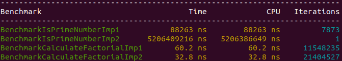
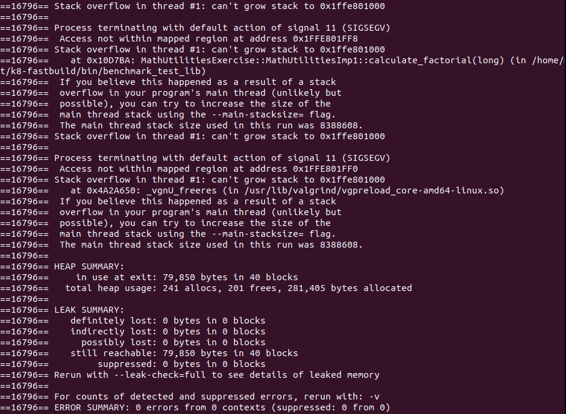

### Take-home project writeup

#### Usage of take-home project

- This is the bazel version, so bazel has to be installed: [`Bazel Installation`](https://docs.bazel.build/versions/master/install.html)

- Once bazel is installed the normal bazel commands can be used or the included bash scripts, e.g `./run_unit_tests.sh` and `./run_benchmark_math_utilities.sh` to run the tests and benchmarks
___

#### Performace Comparison of `MathUtilitiesImp1` and `MathUtilitiesImp2`

- Performance of `MathUtilitiesImp1` is superior to `MathUtilitiesImp2` in the function `is_prime_number()`. And vice versa in `calculate_factorial()`. Before we look at the result, the library `libsdet_test.a` was built in Debug Mode (when trusting benchmark.h), which can reduce performance quiet a bit.

- Performance for the `is_prime_number()` function was tested with the prime number _2147483647_, which coincidentally is the maximum value of `int`

    - `MathUtilitiesImp1 is_prime_number()` checked the prime number within _~88263 ns_ on my specific system
    - `MathUtilitiesImp2 is_prime_number()` checked the prime number within _~5206409216 ns_ on my specific system
    - `MathUtilitiesImp1 is_prime_number()` is **substantially faster** in this test than `MathUtilitiesImp2 is_prime_number()`!

- Performance for the `calculate_factorial()` function was tested with _20!_, which exhausts the value range of type `long` quiet a lot

    - `MathUtilitiesImp1 calculate_factorial()` calculated the factorial within _~60.2 ns_ on my specific system
    - `MathUtilitiesImp2 calculate_factorial()` calculated the factorial within _~32.8 ns_ on my specific system
    - `MathUtilitiesImp2 calculate_factorial()` is about __twice__ as fast in this test as `MathUtilitiesImp1 calculate_factorial()`

    
___

#### Issues with `MathUtilities` (Base class)

- The Base class `MathUtilities` does not provide a virtual destructor, which leads to memory leaks in case inheritance is used.

- The function `calculate_factorial()` uses the type `long` as input and output parameter. This is problematic as the factorial of any given number will always be bigger then the input number, high input numbers can potentially lead to overflow in this function (in this case overflow gets prevented to certain extend)
___

#### Issues with `MathUtilitiesImp1` and `MathUtilitiesImp2`

- Both classes implement the pure virtual functions of `MathUtilities`, but they still keep the `virtual` keyword, which is problematic because this leaves the door open for any other class to override the function once more when inheriting from the derived classes. Derived classes shouldn't be inherited in almost all circumstances. Furthermore derived class should use the `final` keyword, when there is no intention of inheriting them. This would also prevent [_name hiding_](https://bastian.rieck.me/blog/posts/2016/name_hiding_cxx/)

- `calculate_factorial()` seems to be protected against overflow only to an extend!

- `calculate_factorial()` breaks when using the max value for type `long` as input parameter! When running with _Valgrind_ it turns out that this input parameter results in a **stack overflow** (in my system with a stack size of _8388608bytes_, exhausting the _8MB_ of stack storage typically found in modern Linux systems by default) and the code terminates with a __segmentation fault__! See screenshot at the bottom

- `calculate_factorial()` returns _0_ when the variable overflows, this is not mentioned in the class, so it might be unintended behavior!

- `calculate_factorial()` of class `MathUtilitiesImp1` is calculating the factorial incorrect starting from _14!_

- `is_prime_number()` seems to recognize negative primes as valid primes. It has however problems detecting small prime numbers. In both classes _-2_ is not detected as a prime number. In `MathUtilitiesImp2` even prime number _2_ is not recognized as a prime number. Both classes also detect _-1_ as a prime number, which is incorrect
___

#### Issues with `Counter`

- The Base class `Counter` does not provide a virtual destructor, which leads to memory leaks in case inheritance is used.

- The functions `increment()`, `decrement()` and `set_counter()` are all returning the current counter, which is uncommon for these type of functions. One would expect these functions to not return anything and just do their job by modifying the `m_counter` variable. A dedicated get function should be responsible for returning the `m_counter` variable to the user. Using these functions would always require an assignment of the return value to a highly unlikely used variable, which would then violate guidelines like _MISRA_

- The function `decrement()` is violating the counter range. Values are supposed to be within a range of _0_ to _1000000_
___

#### Issues with `ExtendCounter`

- `ExtendCounter` is vulnerable to name hiding as it doesn't include the `final` keyword

- The function `subtract()` is violating the counter range. Values are supposed to be within a range of _0_ to _1000000_

- The function `add()` and `subtract()` do not allow the addition or subtraction of negative numbers. From a math standpoint, this should be possible, from a design standpoint this would make separate functions for addition and subtraction unnecessary
- Unnecessary functions for addition and subtraction, confusing design decision

- From a design perspective the `ExtendCounter` class is not a typical derived class. It does not directly implement/override or overload any functions of the base class. In this case, one could argue that [_composition should be used over inheritance_](https://en.wikipedia.org/wiki/Composition_over_inheritance), which would also be in line with the clean code principles
___

#### Thread safety of `ExtendCounter`

- `ExtendCounter` seems to be thread-safe. Thread Safety was measured in a separate test ([`thread_safety_extend_counter_fixture.cpp`](test/thread_safety_extend_counter_fixture.cpp)). [_ThreadSanitizer_](https://github.com/google/sanitizers/wiki/ThreadSanitizerCppManual) was used to detect any thread safety related issues. To test if _ThreadSanitizer_ is working probably I created a very basic implementation of the `ExtendCounter` class called `NonThreadSafeCounter` which does not include any thread safety related measurements. When tested with threaded function calls the `NonThreadSafeCounter` class reported a _data race_, whereas _ThreadSanitizer_ did not detect any for the `ExtendCounter` class. This leads me to believe that `ExtendCounter` is thread safe. I also tested the `ExtendCounter` class with [`Intel's Inspector`](https://software.intel.com/en-us/inspector) application. It did report a _data race_ for the `ExtendCounter` class, but I believe this to be a false positive as _ThreadSanitizer_ did not report any warnings.
___

#### Valgrind report of stack overflow and segmentation fault in `calculate_factorial()` for LONG_MAX input parameter

  